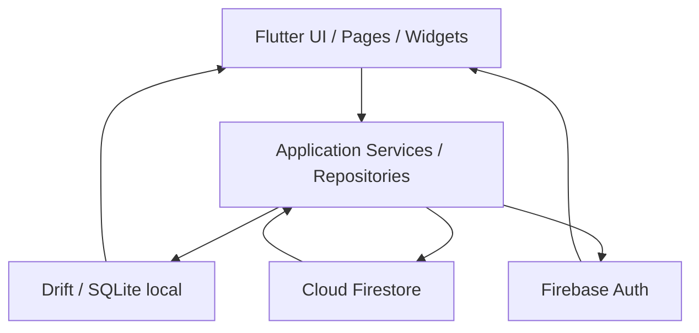
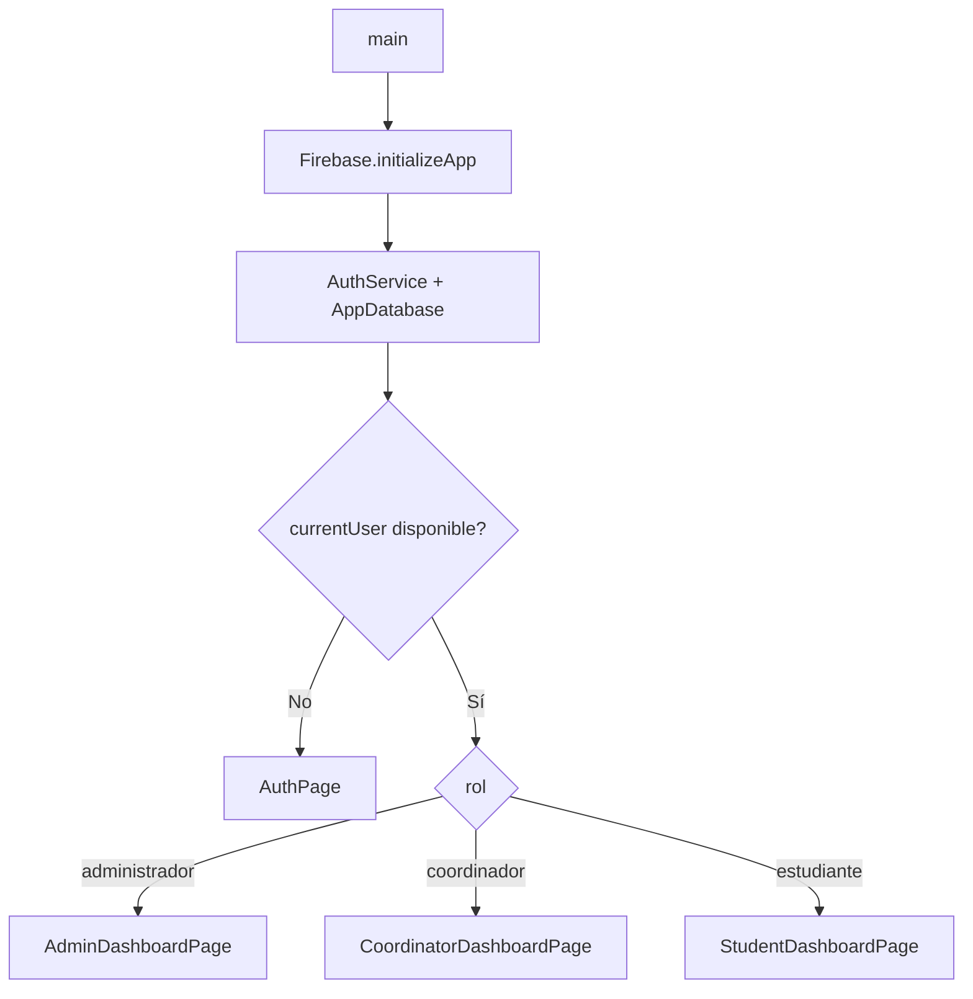

# Solicitudes de Movilidad Académica

Aplicación Flutter para gestionar solicitudes de movilidad académica con autenticación Firebase, persistencia local en Drift/SQLite y sincronización con Cloud Firestore.

## Descripción General

El sistema implementa un flujo de trabajo para tres roles principales:

- `estudiante`
- `coordinador`
- `administrador`

La aplicación arranca con autenticación, resuelve el rol del usuario desde la base local y dirige al panel correspondiente. El diseño funcional actual está orientado a un modelo offline-first: la información se guarda en local primero y luego se sincroniza con Firestore cuando hay conectividad. El alta desde la pantalla de autenticación crea la cuenta, pero el estado inicial del usuario registrado queda `inactivo`, por lo que su acceso efectivo depende de una activación posterior.

## Objetivo De Negocio

Centralizar la gestión de solicitudes de movilidad académica para:

- reducir errores manuales en el proceso,
- mantener trazabilidad de cambios,
- permitir revisión por coordinadores,
- administrar usuarios desde el rol administrativo,
- conservar operación local aun sin conexión estable.

## Características Principales

- Autenticación con Firebase Authentication.
- Roles funcionales separados por interfaz y permisos.
- Creación, edición, envío y consulta de solicitudes de movilidad.
- Carga de documentos requeridos para el flujo del estudiante.
- Revisión, aprobación y rechazo de solicitudes por coordinador.
- Gestión de usuarios y estados por administrador.
- Persistencia local con Drift/SQLite.
- Sincronización con Cloud Firestore en modo best-effort.
- Registro de historial de estados y aprobaciones.
- Validaciones de formularios y reglas de negocio en capa de dominio.

## Arquitectura Del Sistema

La solución combina una arquitectura por capas con separación por feature:



### Capas

- Presentación: `pages`, `widgets`.
- Aplicación: `services`, `repositories`.
- Dominio: validadores y políticas de acceso.
- Datos: Drift `AppDatabase` y modelos de Firestore.
- Integración: Firebase Auth y Cloud Firestore.


## Dependencias Principales

Declaradas en `pubspec.yaml`:

- `firebase_core`
- `firebase_auth`
- `cloud_firestore`
- `http`
- `drift`
- `drift_flutter`
- `sqlite3_flutter_libs`
- `path_provider`
- `uuid`
- `flutter_lints`
- `build_runner`
- `drift_dev`
- `firebase_auth_mocks`
- `mocktail`

## Requisitos Previos

- Flutter SDK instalado.
- Dart SDK compatible con `^3.12.0`.
- Firebase project configurado.
- Android Studio y/o Xcode para compilación nativa.
- Permisos para crear y firmar builds de producción.

## Instalación Paso A Paso

1. Clonar el repositorio.
2. Entrar al proyecto:

```bash
cd solicitudes_movilidad_academica
```

3. Obtener dependencias:

```bash
flutter pub get
```

4. Verificar análisis estático:

```bash
dart analyze
```

5. Ejecutar pruebas:

```bash
flutter test
```

## Configuración De Entorno


### Variables y parámetros relevantes

- `projectId`: `xchange-5783f`
- `storageBucket`: `xchange-5783f.firebasestorage.app`
- `android package`: `com.example.solicitudes_movilidad_academica`
- `ios bundle id`: `com.example.solicitudesMovilidadAcademica`

## Configuración Firebase

El proyecto está configurado para inicializar Firebase mediante `DefaultFirebaseOptions.currentPlatform`.

```dart
await Firebase.initializeApp(
  options: DefaultFirebaseOptions.currentPlatform,
);
```

### Plataformas soportadas

- Web
- Android
- iOS
- macOS
- Windows


## Estructura De Carpetas

```text
solicitudes_movilidad_academica/
├── lib/
│   ├── data/                  # Drift, base local y acceso a estado
│   ├── features/
│   │   ├── auth/              # Login, registro, servicio de autenticación
│   │   ├── student/           # Flujo de solicitudes del estudiante
│   │   ├── coordinator/       # Revisión y decisión de solicitudes
│   │   └── admin/             # Gestión de usuarios
│   └── shared/                # Modelos, utilidades y widgets compartidos
├── test/                      # Pruebas unitarias y de widget
├── android/                   # Configuración Android
├── ios/                       # Configuración iOS
├── web/                       # Artefactos web y worker de Drift
├── firestore.rules            # Reglas de seguridad Firestore
└── pubspec.yaml               # Dependencias y configuración Flutter
```

## Flujo De Navegación



### Rutas funcionales

- `AuthPage`: login y registro.
- `StudentDashboardPage`: panel principal del estudiante, acceso a crear y consultar solicitudes.
- `StudentApplicationFormPage`: formulario por pasos para crear o editar borradores.
- `StudentApplicationDetailPage`: detalle, documentos, historial y envío.
- `CoordinatorDashboardPage`: tablero de revisión de solicitudes.
- `CoordinatorSolicitudDetailPage`: detalle y aprobación/rechazo.
- `AdminDashboardPage`: gestión de usuarios.

## Gestión De Estados

La aplicación usa una combinación de:

- `ChangeNotifier` para `AuthService`.
- `InheritedNotifier` para exponer `AuthServiceScope` y `AppStateScope`.
- `StreamBuilder` para reaccionar a cambios en Drift.
- `setState` para estados locales de formulario, tabs y diálogos.

### Criterio de diseño

- Estado global mínimo.
- Datos persistidos en local como fuente operativa principal.
- Sincronización remota asíncrona y tolerante a fallos.

## Gestión De Errores

El proyecto maneja errores con:

- excepciones `StateError` para reglas de negocio incumplidas,
- `ArgumentError` para parámetros inválidos,
- `SnackBar` para retroalimentación al usuario,
- capturas `try/catch` en operaciones de sincronización,
- mensajes legibles en formularios y diálogos.

## Convenciones De Desarrollo

- Nombres de capas por feature.
- Modelos compartidos para interoperabilidad entre local y remoto.
- Normalización de roles y estados en la capa de modelo.
- Validaciones de negocio separadas de la UI.
- Uso de `pendingSync` para distinguir datos locales pendientes.
- Manejo de fechas con `DateTime` y serialización explícita a Firestore.

## Estrategia De Testing

Cobertura actual observada:

- Unit testing: validadores, políticas y lógica de repositorio.
- Widget testing: pantallas principales y componentes compartidos.


## Compilación iOS

```bash
flutter build ios --release
```

### Consideraciones

- Requiere macOS con Xcode.
- Requiere firma válida y provisioning profiles.
- Verificar `GoogleService-Info.plist` y el bundle id del target.

## Despliegue

No se observa pipeline de CI/CD definido para build, test y despliegue. El despliegue debe definirse según plataforma:

- iOS: generar archive, validar firma y distribuir por TestFlight/App Store.
- Firestore: revisar reglas antes de liberar.

## Licencia

Pendiente de validación en el código fuente.
